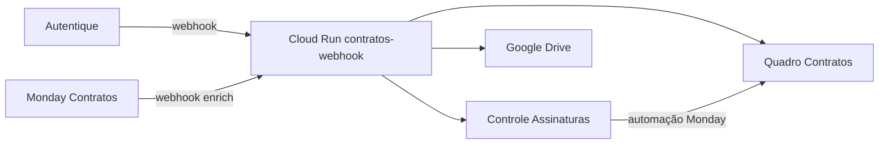

# Roadmap — Automação de contratos (status e próximos passos)

Última atualização: jul/2026.

## Visão geral do fluxo alvo (24h)



| Etapa | Gatilho | Resultado |
|-------|---------|-----------|
| 1 | `document.created` | Item no Controle (Jan/Luciano, Tipo RH/B2B/…) |
| 2 | `signature.accepted` | Status e grupo atualizados no Controle |
| 3 | `document.finished` | PDF no Drive + Controle Assinado |
| 4 | Automação Monday | Move para quadro Contratos quando Assinado + Tipo |
| 5 | Webhook Monday (opcional) | Enriquece colunas (CNPJ, datas, Gemini) |

---

## Status por etapa

### ✅ Concluído

| Item | Detalhe |
|------|---------|
| Código webhook + pipeline | PRs mergeados em `main` |
| Sync Controle via GitHub Actions | Último sync: ~99 itens criados, Tipo **RH** |
| Tipo **RH** + automação move Contratos | Criado no Monday pelo jurídico |
| Limpeza duplicatas | Contratos: −157; Controle (ID Autentique): −4 |
| Catch-up manual | Workflows `Sync Controle` e `Catch-up contratos` |
| Secrets no GitHub Actions | Monday, Autentique, Gemini, Gmail |

### 🔄 Em andamento (modo manual)

Enquanto o Cloud Run não sobe, usar **GitHub Actions**:

1. **Sync Controle Assinaturas** — novos documentos no Autentique → Controle
2. **Catch-up contratos** — Controle + processar assinados → Drive + Monday (Gemini)

### ❌ Bloqueado — Deploy GCP (Cloud Run)

O workflow **Bootstrap contratos GCP** falha no passo `gcloud run deploy` (Cloud Build step 2).

**Último build:** `06c76e08-36dd-4057-803b-89ea14e2d99b`  
**Console:** https://console.cloud.google.com/cloud-build/builds/06c76e08-36dd-4057-803b-89ea14e2d99b?project=400726216705

**Pedido para TI** (projeto `b4a-prj-integration-prd`, número `400726216705`):

1. Na SA **`400726216705-compute@developer.gserviceaccount.com`** → Permissões → conceder a **`400726216705@cloudbuild.gserviceaccount.com`** o papel **Service Account User** (dentro da SA, não só no projeto).
2. No **IAM do projeto** → conceder à compute SA o papel **Secret Manager Secret Accessor**.
3. Confirmar que Cloud Build SA tem: **Cloud Run Admin**, **Secret Manager Secret Accessor**, **Service Account User**.

Depois: Actions → **Bootstrap contratos GCP** → Run workflow (não Re-run).

### ⏳ Pendente — após Cloud Run no ar

| # | Ação | Quem |
|---|------|------|
| 1 | Copiar URL do Summary: `…/webhooks/autentique` | TI / agente |
| 2 | Autentique → Webhooks → criar endpoint com eventos `document.created`, `signature.accepted`, `document.finished` | Jurídico |
| 3 | Salvar secret HMAC → Secret Manager `contratos-autentique-webhook-secret` | TI |
| 4 | Redeploy com `cloudbuild-contratos.yaml` (com secret webhook) | Bootstrap ou Cloud Build |
| 5 | Registrar webhook Monday no quadro Contratos (enriquecimento) → `…/webhooks/monday` | Jurídico + TI |
| 6 | Smoke test: criar/assinar documento teste | QA |

### 📋 Monday (regras de negócio)

| Tipo | Automação move Contratos | Status |
|------|--------------------------|--------|
| RH | ✅ | Criada |
| B2B, B4A, NDA, Influencers, … | ✅ | Já existiam |
| Prestação de Serviços | ⏳ | Criar quando definir label exato |
| Código de Conduta | ⏳ | RH ou subitem — definir |

---

## Comandos rápidos (agente / TI)

```bash
# Simular catch-up completo
gh workflow run "Catch-up contratos (Autentique → Monday/Drive)" \
  -f dry_run=true -f max_pages=50

# Aplicar catch-up
gh workflow run "Catch-up contratos (Autentique → Monday/Drive)" \
  -f dry_run=false -f max_pages=50 -f skip_gemini=false

# Só Controle
gh workflow run "Sync Controle Assinaturas (Autentique)" \
  -f dry_run=false -f max_pages=50

# Deploy GCP (após IAM)
gh workflow run "Bootstrap contratos GCP (secrets + deploy)" \
  -f project_id=b4a-prj-integration-prd
```

---

## Validação pós catch-up

1. Controle: novos itens com Tipo correto (RH para férias/PJ/CLT/…).
2. Itens **Assinado** + Tipo → aparecem no quadro Contratos (automação Monday).
3. Drive: PDF em `1 - Contratos / RH - CLT` ou `RH - PJ` conforme tipo.
4. Contratos: colunas CNPJ/datas preenchidas (Gemini) nos itens processados pelo catch-up.

---

## Riscos conhecidos

| Risco | Mitigação |
|-------|-----------|
| Duplicatas no Contratos | Scripts `scripts/cleanup_*_duplicates.py`; catch-up ignora Controle já Assinado |
| Timeout Gemini no catch-up | Workflow 120 min; falhas isoladas não param o lote |
| GCP IAM | Seguir checklist TI acima antes de novo bootstrap |
