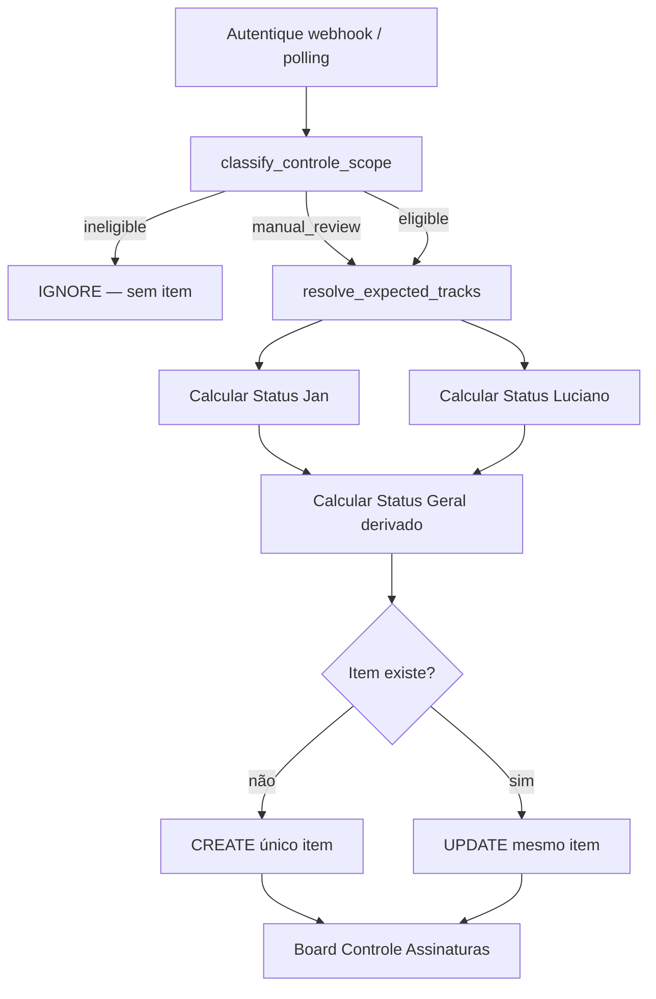
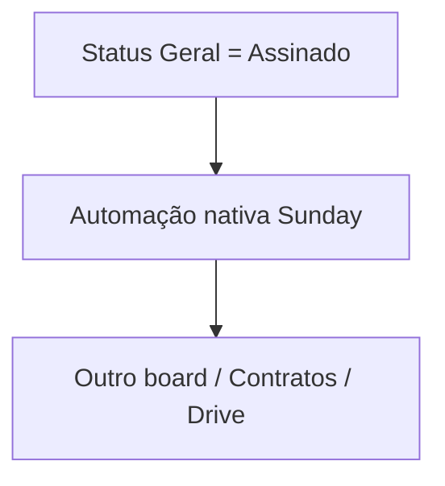

# Controle Assinaturas — greenfield no Sunday (schema v1)

> **Status:** `SUNDAY_SCHEMA_READY_FOR_APPROVAL` — aguardando aprovação humana antes de qualquer implementação.  
> **Fonte da verdade:** Autentique (documentos, signatários, assinaturas, PDF).  
> **Destino:** Sunday — board **Legal - Controle de Assinaturas** (workspace 22; sandbox 80 para testes).  
> **Legado Monday:** congelado; **não participa** do novo sync Sunday. Ver decisão de congelamento em PRs/docs da etapa 2.

## Decisão arquitetural aprovada

| Aspecto | Decisão |
|---------|---------|
| Granularidade | **1 item Sunday = 1 documento Autentique** |
| Chave de identidade | `autentique_document_id` (única; nunca `(id, track)`) |
| Filas Jan/Luciano | **Três colunas de status no mesmo item** — não duplicar linhas |
| Monday | Legado congelado; sem sync, sem migração dos 1.607 itens |
| Nesta etapa | **Somente documentação** — sem `sunday/client.py`, sem writes, sem board |

### Princípios

1. **Autentique → Sunday** — UPSERT idempotente por `autentique_document_id`.
2. **Sem deduplicação por título** — identidade exclusivamente pelo ID Autentique.
3. **Sem auto-archive por padrão de título** — `ineligible` = não criar item.
4. **Status Geral é derivado** — calculado pela integração; único gatilho de conclusão para automações futuras.
5. **Grupo é organização visual** — estado de negócio vive nas colunas de status, não no grupo.

---

## 1. Modelo de assinatura (três status no mesmo item)

Cada item possui **três colunas de status independentes**. As assinaturas individuais de Jan e Luciano **não** representam conclusão do documento.

### Status Jan

| Opção | Significado |
|-------|-------------|
| `Aguardando Jan` | Jan é signatário requerido (`jan` ∈ `expected_tracks`) e ainda não assinou no Autentique |
| `Jan assinou` | Jan assinou no Autentique; **não** dispara automação de conclusão |
| `Não requerido` | `jan` ∉ `expected_tracks` |

### Status Luciano

| Opção | Significado |
|-------|-------------|
| `Aguardando Luciano` | Luciano é signatário requerido e ainda não assinou |
| `Luciano assinou` | Luciano assinou no Autentique; **não** dispara automação de conclusão |
| `Não requerido` | `luciano` ∉ `expected_tracks` |

### Status Geral (derivado — integração é source of truth)

| Opção | Significado |
|-------|-------------|
| `Aguardando assinatura` | Pelo menos um signatário interno requerido ainda não assinou; nenhum assinou ainda |
| `Parcialmente assinado` | Pelo menos um requerido assinou e pelo menos um requerido ainda pendente |
| `Assinado` | **Única opção que representa conclusão** do ciclo de assinaturas internas |
| `Revisão manual` | Caso ambíguo, terminal negativo no Autentique, ou nenhum signatário interno reconhecido |

### Regra crítica para automações futuras

```
✅ Gatilho de conclusão:  Status Geral = Assinado
❌ Nunca usar:            Status Jan = Jan assinou
❌ Nunca usar:            Status Luciano = Luciano assinou
```

Automações nativas do Sunday (mover/criar/vincular em outros boards) devem observar **exclusivamente** `Status Geral = Assinado`.

Se o Sunday não permitir bloquear edição manual das colunas de status, a integração permanece source of truth: qualquer alteração manual será **sobrescrita** no próximo sync.

---

## 2. Regras de cálculo dos três status

### Entradas

1. `expected_tracks` ← `resolve_expected_tracks(document)` — define **quais assinaturas internas são requeridas** neste item (não quantos itens criar).
2. Estado de assinatura no Autentique ← `signer_identity` + `signed_at` de cada signatário interno.
3. Estado terminal no Autentique ← `resolve_controle_terminal_status(document)` (recusado / bloqueado).

### Algoritmo conceitual (v1)

```
expected = resolve_expected_tracks(document)

if expected is empty:
    Status Jan      = Não requerido
    Status Luciano  = Não requerido
    Status Geral    = Revisão manual
    (item só existe se scope = manual_review; ver seção Scope)

if resolve_controle_terminal_status(document) is not None:
    Status Geral = Revisão manual
    Motivo da revisão = código terminal (ex.: refused, blocked)
    (Status Jan/Luciano calculados normalmente para contexto)

jan_required    = "jan" in expected
luc_required    = "luciano" in expected
jan_signed      = _internal_signer_signed(document, track="jan")
luc_signed      = _internal_signer_signed(document, track="luciano")

Status Jan =
    Não requerido           if not jan_required
    Jan assinou             if jan_signed
    Aguardando Jan          otherwise

Status Luciano =
    Não requerido           if not luc_required
    Luciano assinou         if luc_signed
    Aguardando Luciano      otherwise

required_signed_count = count(signed for s in required tracks)
required_pending_count = count(pending for s in required tracks)

Status Geral =
    Assinado                if required_pending_count == 0 and required_signed_count > 0
    Parcialmente assinado   if required_signed_count > 0 and required_pending_count > 0
    Aguardando assinatura   if required_signed_count == 0 and required_pending_count > 0
    Revisão manual          if expected is empty (já tratado acima)
```

**Invariante:** com `expected_tracks` vazio, `Status Geral` **nunca** pode ser `Assinado`.

### Tabela de exemplos obrigatórios

| Cenário | Status Jan | Status Luciano | Status Geral |
|---------|------------|----------------|--------------|
| Jan + Luciano requeridos; nenhum assinou | `Aguardando Jan` | `Aguardando Luciano` | `Aguardando assinatura` |
| Jan + Luciano; só Jan assinou | `Jan assinou` | `Aguardando Luciano` | `Parcialmente assinado` |
| Jan + Luciano; só Luciano assinou | `Aguardando Jan` | `Luciano assinou` | `Parcialmente assinado` |
| Jan + Luciano; ambos assinaram | `Jan assinou` | `Luciano assinou` | `Assinado` |
| Só Luciano requerido; pendente | `Não requerido` | `Aguardando Luciano` | `Aguardando assinatura` |
| Só Luciano requerido; assinou | `Não requerido` | `Luciano assinou` | `Assinado` |
| Só Jan requerido; assinou | `Jan assinou` | `Não requerido` | `Assinado` |
| Nenhum signatário interno reconhecido | `Não requerido` | `Não requerido` | `Revisão manual` |

### Estados terminais no Autentique

Documentos **recusados** ou **bloqueados** no Autentique (`resolve_controle_terminal_status`):

- `Status Geral` → `Revisão manual` (nunca `Assinado`)
- `Motivo da revisão` → código legível (`signature_refused`, `signing_blocked`, etc.)
- Status Jan/Luciano calculados normalmente para contexto operacional

---

## 3. Regra de scope (`classify_controle_scope`)

Continua usando `classify_controle_scope(document, expected_tracks=resolve_expected_tracks(document))`.

| Classificação | Comportamento no Sunday (futuro) | Item no board? |
|---------------|----------------------------------|----------------|
| `eligible` | UPSERT normal no Controle Assinaturas | Sim |
| `ineligible` | **IGNORE** — não criar, não atualizar | Não |
| `manual_review` | UPSERT com `Status Geral = Revisão manual` e `Scope = manual_review` | Sim |

### Exemplos `ineligible` (não criar)

- Férias, rescisões trabalhistas/RH, declarações, plano de saúde, admissão, TCE, código de conduta, etc. (regras em `controle_scope.py`).
- Documento sem signatário interno reconhecido (`no_internal_signer`).

### Exemplos `manual_review` (visível, separado operacionalmente)

- Título genérico com "contrato" sem domínio claro (`generic_contrato_title`).
- Domínio incerto (`uncertain_domain`).
- Documento sem assinaturas e sem signatário interno (`no_signatures_no_internal_signer`).

### Recomendação técnica: representação de `manual_review`

| Abordagem | Prós | Contras |
|-----------|------|---------|
| **A — Mesmo board + grupo + view** (recomendado) | Uma fonte de dados; filas operacionais e revisão coexistem; sync único | Requer disciplina visual (views/grupo) |
| B — Board separado de revisão | Isolamento forte | Dois syncs; duplicação de schema; mais complexo |
| C — Só view, sem grupo dedicado | Menos manutenção de grupo | Itens de revisão misturados no grupo padrão |

**Recomendação final (v1):** abordagem **A**.

- **Mesmo board** para todos os itens sincronizados.
- **Grupo** `Revisão necessária` para itens com `Scope = manual_review` (organização visual; integração pode mover no sync).
- **View** `Revisão manual` filtrando `Scope = manual_review` OR `Status Geral = Revisão manual`.
- Coluna **Scope** distingue elegibilidade; **Status Geral = Revisão manual** cobre também terminais Autentique e `expected_tracks` vazio.

Itens `ineligible` **nunca** entram no board — nem em grupo de revisão.

---

## 4. Schema v1 do board Sunday

### Board

| Atributo | Valor |
|----------|-------|
| Nome produção | **Legal - Controle de Assinaturas** |
| Workspace | 22 |
| Sandbox testes | board 80 (F0.14) |
| Coluna estrutural **Área** | Ignorável pelo adapter (`is_system=true`; confirmado F0.14) |

### Tabela de colunas

| Nome | Tipo Sunday | Key sugerida | Opções | Origem | Obrigatório | Quem escreve | Finalidade | Automações futuras |
|------|-------------|--------------|--------|--------|-------------|--------------|------------|-------------------|
| **Documento** | `text` (nome do item) | _(nome do item)_ | — | Autentique `document.name` | Sim | Integração (create); usuário pode renomear (sobrescrito no sync se política strict) | Identificação humana | Exibição em views e relações |
| **Autentique ID** | `text` | `autentique_id` | — | Autentique `document_id` | Sim | Integração | **Chave de identidade** para UPSERT | Lookup/idempotência; não usar em automação de conclusão |
| **Link Autentique** | `link` | `link_autentique` | — | URL do documento no Autentique | Sim | Integração | Abrir documento na origem | — |
| **Tipo** | `status` custom (`is_system=false`) | `tipo` | Ver seção Tipo | `resolve_controle_tipo_label` | Não | Integração (heurística/Gemini) | Categorização contratual | Filtros; futura roteagem para board Contratos |
| **Status Jan** | `status` custom | `status_jan` | `Aguardando Jan`, `Jan assinou`, `Não requerido` | Calculado (seção 2) | Sim | Integração | Fila operacional Jan | **Não** usar como gatilho de conclusão |
| **Status Luciano** | `status` custom | `status_luciano` | `Aguardando Luciano`, `Luciano assinou`, `Não requerido` | Calculado (seção 2) | Sim | Integração | Fila operacional Luciano | **Não** usar como gatilho de conclusão |
| **Status Geral** | `status` custom | `status_geral` | `Aguardando assinatura`, `Parcialmente assinado`, `Assinado`, `Revisão manual` | **Derivado** (seção 2) | Sim | Integração (somente) | Estado agregado do ciclo interno | **Gatilho único** de conclusão (`Assinado`) |
| **Scope** | `status` custom | `scope` | `eligible`, `manual_review` | `classify_controle_scope` | Sim | Integração | Classificação de elegibilidade | Filtrar view Revisão; `ineligible` não gera item |
| **Motivo da revisão** | `text` | `motivo_revisao` | — | Código/mensagem de `classify_controle_scope` ou terminal Autentique | Condicional | Integração | Explicar por que está em revisão | — |
| **Última sincronização** | `date` ou `text` (ISO-8601) | `ultima_sincronizacao` | — | Timestamp do sync | Sim | Integração | Auditoria operacional | — |

### Colunas avaliadas e **excluídas** do v1

| Coluna candidata | Decisão v1 | Motivo |
|------------------|------------|--------|
| Data criação Autentique | **Não incluir** | Disponível na origem; ordenação inicial pode usar nome/sync; adicionar em v2 se operação exigir |
| Fornecedor / contraparte | **Não incluir** | Extração não confiável sem PDF/Gemini; pertence ao fluxo Contratos, não ao Controle |
| Responsável | **Não incluir** | Filas já cobertas por Status Jan/Luciano + views |
| `board_relation` → Contratos | **Não incluir** | F0.14 confirmou suporte nativo; relação será criada pela **automação** pós-`Assinado`, não no schema inicial |
| Versão de sync / hash | **Não incluir** | `Última sincronização` basta para v1; hash útil só se houver conflitos frequentes |

### Status Geral — campo derivado (obrigatório na implementação)

`Status Geral` é **sempre** calculado pela integração a partir de:

1. `expected_tracks` (`resolve_expected_tracks`)
2. Estado individual dos signatários no Autentique (`_internal_signer_signed`)
3. Regras de scope/terminal quando aplicável

**Não** deve depender de edição manual. Se o usuário alterar manualmente, o próximo sync restaura o valor calculado.

---

## 5. Coluna Tipo

Reutiliza `controle_tipo.py` e o conjunto `MONDAY_CONTROLE_TIPO_LABELS` (`constants.py`).

### Opções no Sunday (status custom)

| Opção | Origem típica |
|-------|---------------|
| `Contratos B4A` | Heurística / Gemini |
| `Contratos MMKT` | Heurística / Gemini |
| `Contratos Itaro` | Heurística / Gemini |
| `Contratos RV BVI` | Heurística / Gemini |
| `Contratos Aurora` | Heurística / Gemini |
| `Contratos Societários` | Heurística / Gemini |
| `Contratos B2B` | Heurística / Gemini |
| `NDA` | Heurística (título) / Gemini |
| `Contratos Influencers (Queens)` | Heurística / Gemini |
| `Contratos Jan` | Heurística |
| `Pedidos Marcas Próprias` | Heurística |
| `RH` | Heurística (CLT/PJ) |

### Excluído de propósito

| Label | Motivo |
|-------|--------|
| `Contratos de Câmbio` | Já excluído do Controle Monday (`MONDAY_CONTROLE_TIPO_LABELS`); grupo só no board Contratos |

### Documentos suplementares (aditivo, procuração, distrato, NDA)

| Tipo documento | Scope | Tipo no Sunday |
|----------------|-------|----------------|
| Aditivo | `eligible` (`supplemental_document`) | Herda do principal via `classify_accessory_follows_principal` ou Gemini com PDF; pode ficar **vazio** até classificação |
| Procuração | `eligible` | Gemini com PDF; heurística raramente suficiente |
| Distrato | `eligible` | Idem aditivo |
| NDA | `eligible` | Heurística frequente (`NDA` no título) |

### Quando Tipo fica vazio (valor `null` / sem label)

Conforme `should_omit_controle_tipo` e `resolve_controle_tipo_label`:

- Documentos internos sem categoria explícita.
- Acessórios sem PDF disponível para Gemini.
- Confiança heurística/Gemini abaixo do limiar configurado.

**Não criar opções novas** no Sunday além da lista acima sem decisão de produto.

---

## 6. Grupos do board

### Recomendação v1

| Grupo | Conteúdo | Quem move | Papel |
|-------|----------|-----------|-------|
| **Em assinatura** | Itens operacionais (`Scope = eligible`, `Status Geral` ≠ `Assinado`) | Integração (opcional, no sync) | Organização visual padrão |
| **Revisão necessária** | `Scope = manual_review` ou `Status Geral = Revisão manual` | Integração | Separar casos não operacionais |
| **Assinados** | `Status Geral = Assinado` | Integração (opcional) | Arquivo visual de concluídos |

### Grupo vs View — decisão

| Critério | Grupo | View |
|----------|-------|------|
| Filas Jan/Luciano | Ruim (exigiria 2 linhas no modelo antigo) | **Ideal** — filtro em `Status Jan` / `Status Luciano` |
| Estado parcial | View `Parcialmente assinado` | **Ideal** |
| Conclusão para automação | **Status Geral**, não grupo | View `Assinados` para humanos |
| Revisão manual | Grupo dedicado ajuda visibilidade | View `Revisão manual` complementa |

**Decisão:** **Status é fonte de verdade**; grupos são conveniência visual opcional movida pela integração. **Views são o mecanismo principal** para filas operacionais (Jan, Luciano, parcial, revisão, assinados). Automações futuras **não** devem depender do grupo.

---

## 7. Views sugeridas

| View | Filtro principal | Público-alvo |
|------|------------------|--------------|
| **Todos** | Sem filtro (ou `Scope` ≠ vazio) | Gestão geral |
| **Aguardando Jan** | `Status Jan = Aguardando Jan` | Jan |
| **Aguardando Luciano** | `Status Luciano = Aguardando Luciano` | Luciano |
| **Parcialmente assinado** | `Status Geral = Parcialmente assinado` | Coordenação |
| **Revisão manual** | `Status Geral = Revisão manual` OR `Scope = manual_review` | Jurídico / triagem |
| **Assinados** | `Status Geral = Assinado` | Arquivo / auditoria |
| **Em andamento** | `Status Geral` ∈ {`Aguardando assinatura`, `Parcialmente assinado`} | Operação diária |

Objetivo principal: Jan e Luciano enxergam **suas filas sem duplicar o documento** em duas linhas.

---

## 8. Relações com outros boards (preparação, sem implementar)

F0.14 confirmou `board_relation` nativo (`PATCH …/values/{col}` com `{"links":[{"item_id":"…"}]}`).

**v1:** não criar coluna `board_relation` no schema inicial.

**Fluxo futuro esperado:**

```
Status Geral → Assinado
        ↓
Automação nativa Sunday (gatilho: status_geral = Assinado)
        ↓
Criar/vincular item no board Contratos (+ board_relation se necessário)
```

A relação será responsabilidade da automação pós-assinatura, não do sync Autentique → Controle.

---

## 9. Chave de identidade e idempotência

### Identidade

```
chave_única = autentique_document_id
```

**Nunca** usar `(autentique_document_id, track)` — modelo dual-track é legado Monday.

### UPSERT (comportamento futuro do sync)

```
Para cada documento Autentique elegível:
  1. classify_controle_scope → ineligible? → SKIP (sem item)
  2. Buscar item Sunday onde autentique_id == document_id
  3. Se não existe → CREATE (um item)
  4. Se existe     → UPDATE (mesmo item)
  5. Recalcular Status Jan, Status Luciano, Status Geral
  6. Atualizar demais colunas derivadas
```

**Garantias:**

- Execuções repetidas do mesmo evento **nunca** criam item duplicado.
- Reprocessamento de webhook/polling é seguro (idempotente).
- Índice em memória no sync: `dict[autentique_document_id → sunday_item_id]`.

---

## 10. Fluxo futuro esperado

### Sync Autentique → Sunday



### Pós-conclusão (fase posterior — automação Sunday)



---

## 11. Código existente — reutilização

### Reutilizar sem alteração

| Módulo / função | Uso no Sunday |
|-----------------|---------------|
| `signer_identity.py` | Identificar Jan vs Luciano (e-mail/nome) |
| `controle_required_tracks.resolve_expected_tracks` | Quais assinaturas são requeridas no item |
| `controle_required_tracks.detect_internal_signers` | Detecção de signatários |
| `controle_required_tracks.track_required_for_document` | Checagem por track |
| `controle_scope.classify_controle_scope` | eligible / ineligible / manual_review |
| `controle_autentique_terminal.resolve_controle_terminal_status` | Recusado / bloqueado → Revisão manual |
| `controle_tipo.resolve_controle_tipo_label` | Coluna Tipo |
| `controle_tipo.classify_controle_tipo_heuristic` | Fallback heurístico |
| `controle_tipo.classify_accessory_follows_principal` | Aditivos seguem principal |
| `controle_tipo.should_omit_controle_tipo` | Quando Tipo fica vazio |
| `controle_status.parse_autentique_signature_date` | Datas de assinatura |
| `controle_status._internal_signer_signed` | Estado por signatário |
| `autentique/client.py` | Feed e metadados Autentique |
| `controle_dedup.normalize_controle_title` | Usado indiretamente por `controle_scope` |

### Precisará adaptação (nova implementação Sunday — **não fazer nesta etapa**)

| Módulo / função | Motivo |
|-----------------|--------|
| `controle_status.resolve_controle_status_for_track` | Modela status **por item Monday** (`Aguardando Assinatura` / `Assinado`); labels e semântica diferentes do Sunday |
| `controle_status.resolve_controle_status_document` | Agregado legado Monday; substituir por `resolve_sunday_status_geral` (nome sugerido) |
| `controle_status.resolve_signed_at_for_track` | Útil, mas labels Sunday diferentes; pode extrair lógica pura |
| `controle_autentique_plan.classify_autentique_document_for_controle` | Acoplado a índice Monday, dedup legado, `CRIAR/VINCULAR/ATUALIZAR` dual-track |
| Novo módulo `sunday/controle_status_sunday.py` (sugerido) | Calcular tri-status + Status Geral derivado |
| Novo módulo `sunday/controle_sync.py` (sugerido) | UPSERT por `autentique_document_id` sem Monday |
| `controle_sync.py` | Sync Monday dual-track — não estender |
| `controle_sync_remediation.py` | Remediação Monday — congelado |
| `controle_track_repair.py` | Reparo de filas duplicadas — obsoleto |
| `controle_reconcile.py` | Reconcile Monday — obsoleto |
| `monday_contracts.py` (escrita Controle) | Substituído por futuro `sunday/client.py` |
| `ensure_controle_dual_tracks_for_document` | Modelo 2 linhas — obsoleto |
| Lógica `missing_tracks` / `unexpected_tracks` | Obsoleta no modelo 1 item |
| Matching legado por título / dedup Monday | Obsoleto — chave é só Autentique ID |

### Não reutilizar

- Dual-track Monday (duas linhas Jan/Luciano).
- `CONTROLE_LINK_TRACK_JAN` / `CONTROLE_LINK_TRACK_LUCIANO` nos links.
- Coluna Monday "Quem Assina".
- Qualquer write no Monday Controle no novo fluxo.

---

## 12. Fora do escopo desta etapa

- Implementar `sunday/client.py`
- Criar board ou colunas no Sunday
- Qualquer write no Sunday
- Migrar 1.607 itens do Monday
- Alterar fluxo de produção (Monday continua congelado)
- Automações Sunday pós-`Assinado`
- `board_relation` no schema v1

---

## 13. Próximos passos (após aprovação do schema)

1. Aprovação humana deste documento (`SUNDAY_SCHEMA_READY_FOR_APPROVAL` → implementação).
2. Configuração manual 1× do board Sunday (colunas, opções de status, views, grupos).
3. Implementar `sunday/client.py` (transporte + CRUD + `values/{col}`).
4. Implementar `resolve_sunday_controle_statuses` (tri-status + derivado).
5. Novo comando `contratos-webhook sync-controle-sunday` — só Autentique → Sunday.
6. Testes unitários espelhando regras de status/scope com backend Sunday mockado.

---

## Veredito

### `SUNDAY_SCHEMA_READY_FOR_APPROVAL`

O schema v1 está completo e consistente com a decisão arquitetural (1 item = 1 documento, tri-status, UPSERT por `autentique_document_id`, Monday congelado).

### Decisões registradas (não bloqueiam aprovação)

| # | Decisão | Escolha v1 |
|---|---------|------------|
| 1 | Representação `manual_review` | Mesmo board + grupo `Revisão necessária` + view dedicada |
| 2 | Grupos vs views para filas | Views como mecanismo principal; grupos opcionais visuais |
| 3 | Colunas extras (data, fornecedor, relation) | Excluídas do v1 |
| 4 | Estados terminais Autentique | Mapeados para `Status Geral = Revisão manual` + `Motivo da revisão` |
| 5 | `board_relation` | Adiado para automação pós-`Assinado` |

Nenhum item acima exige `NEEDS_ARCHITECTURE_DECISION` antes da aprovação do schema; são recomendações técnicas já incorporadas neste documento.
